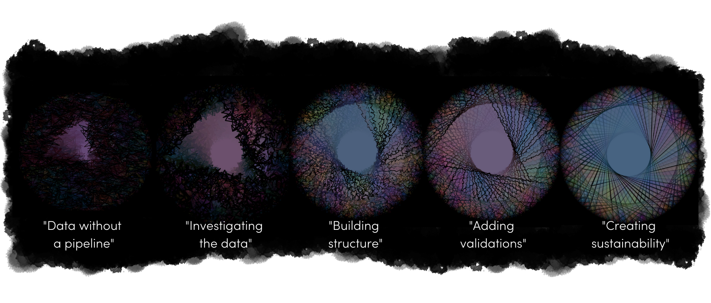

# Resources for Making Data Pipelines in R

## About

This repository contains supplemental resources and materials that coincide with the [*"Making Data Pipelines in R"* talk](https://sched.co/11iZI) presented at [RStudio::conf(2022)](https://www.rstudio.com/conference/2022/schedule/).

*"Making Data Pipelines in R* is a story that aims to present high-level concepts that were found to be useful for creating a data pipeline in R from scratch within the context of the user being self-taught in the R programming language. This context is important because any programmer (especially those that are self-taught) can have knowledge gaps that may make the process of creating automated data pipelines daunting, if not impossible.

This repository is intended to be used as a general learning tool, resource, and source of inspiration for those that are wanting to learn what should be kept in mind when creating data pipelines from scratch in R. Data pipelines is a huge topic that is fluid and varies by industry, organizational setting, and professional use case. Your mileage may vary. Feel free to use anything in this repository that may help you in your own pipeline adventures!

 

## Slides

The slides for *"Making Data Pipelines in R"* can be found on the repository [here](https://meghansaha.github.io/pipelines_in_R).

  

## Example R Scripts (Internal Environment)

Example R Projects and scripts can be found on the repository [here]().

  

## Example (Non-Technical) Documents (First Investigations and External Environment)

Example (Non-Technical) Documents like metadata tables and data workflow diagrams that can be used to disseminate general pipeline information. These documents can be found for modification and download [here]().

  

## Other Relevant R Resources (Validation and Sustainability)

A breakdown of R documentation, packages, and other references that can be useful for making data pipelines in R that can be found [here]().
