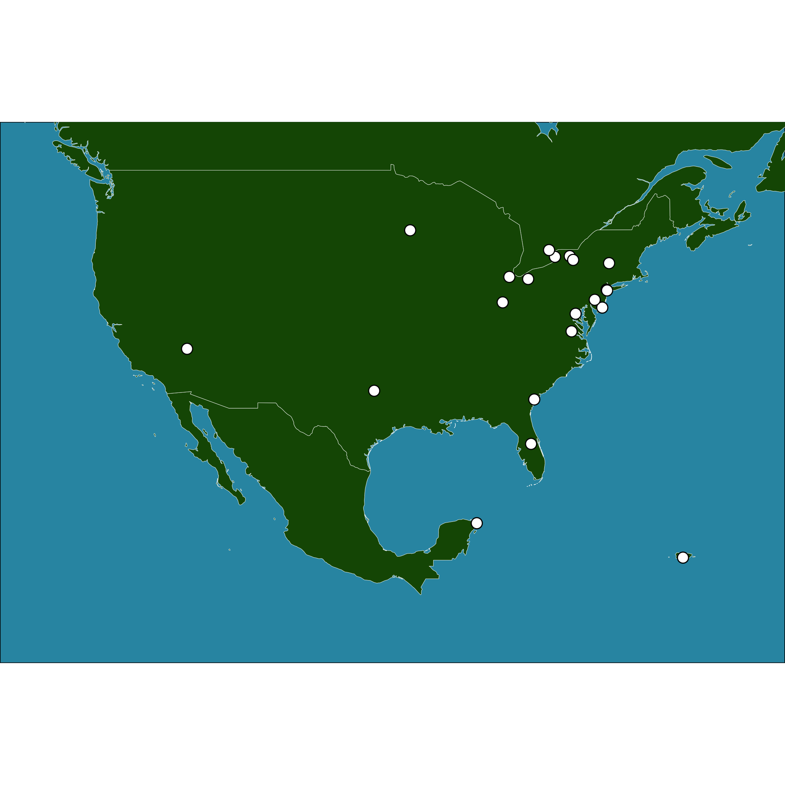

```{r setup, include=FALSE}
knitr::opts_chunk$set(echo = FALSE)
```

This is an example deliverable of an automated report that geographically maps travel location data, and displays a table of the data. Feel free to change/alter this code how you see fit. Be sure that any alterations should be made at your own risk for learning purposes. If you introduce any of these methods into your own work be aware that your results may vary. You should take the time to set up proper data security, storage, and validation methods that best fits your needs.

# Travel Map

## 

```{r locations_table, message=FALSE}
#Packages loaded into your normal environment won't cross over into RMD, must call these in if compiling on demand#
library(dplyr)
library(gt)
library(stringr)

#Loading in data to make table during RMD compilation#
master_geo <- readRDS(here::here("data/master_geo.RDS"))

#Wrangling the data a little for a cleaner table#
geo_table_data <- master_geo %>%
  select(-c(lat,long)) %>%
  rename_with(., ~str_to_title(.), .cols = dplyr::everything())

#This creates the table on the page#
 geo_table_data %>%
  gt() %>%
  tab_header(title = md("**Personal Travel Log**"))
```
