```{r setup, include=FALSE}
options(htmltools.dir.version = FALSE)
xaringanExtra::use_freezeframe(responsive = FALSE)
xaringanExtra::use_extra_styles(
  hover_code_line = TRUE)
```

class: dark, center, middle, animated, fadeIn


???
So I have a story to tell you all about making data pipelines in R, but before I get into that, I have a question to ask all of you. You don't have to answer me out loud, but...
<br><br><br>
When you see this image... Does it make you feel anything? Any ideas on what it is?


<br><br>
Well, this is my personal, 100% accurate representation of a data pipeline. Now you're probably thinking I'm out of my mind, and I might be, but hear me out. Of course this isn't an actual data pipeline, but rather the mental image and feelings I had in my last position as a Data specialist when I was tasked with creating a data pipeline from scratch. 
<br><br>
The story I want to tell you all today is about how I created that pipeline in R within the context of me being a self-taught R programmer in my first professional data position.
<br><br>
Those of us that work in data, when we think of data pipelines, it might look something more like this...
---
class: dark, center, middle, animated, fadeIn

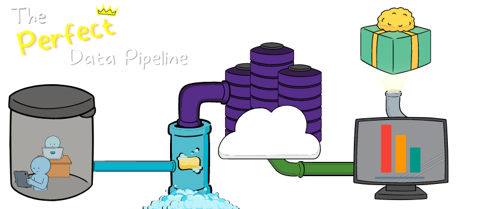

???
The "Perfect" Data Pipeline:
Nice clear processes, clean structures, with great results
<br>
<br>
This is a pipeline to most of us, but in this last position I was in, the pipeline looked nothing like that at all. If we could say there was any pipeline, it was very manual, very clunky, no structure, no automation, just vibes and recklessness. So although I learned a lot and have alot to share, I don't have a lot of time to talk today, so I pulled out four main points that I learned about creating pipelines during this journey.
---
class: light, animated, fadeIn

<h1><span>Main Points</span></h1>
<br><br>
<center>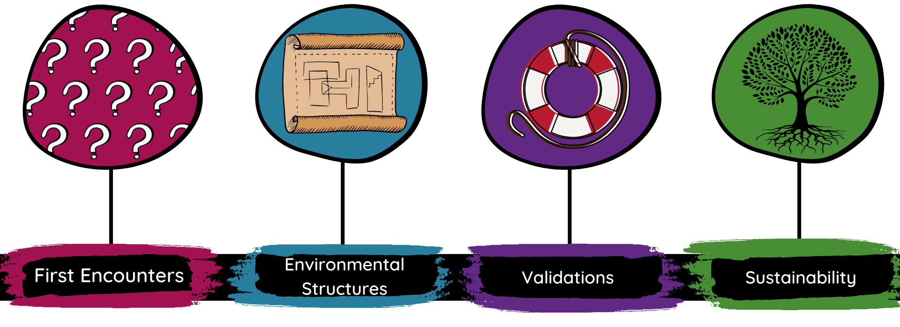</center>

???
-My first encounters with the data in this pipeline<br>
-The importance of identifying the environmental structures of the data pipeline<br>
-Embedding validations within the data pipeline<br>
-Understanding what sustainability looks like for the data pipeline


---
class: light, animated, fadeIn

<h1><span>Main Points</span></h1>
<br><br>
<center>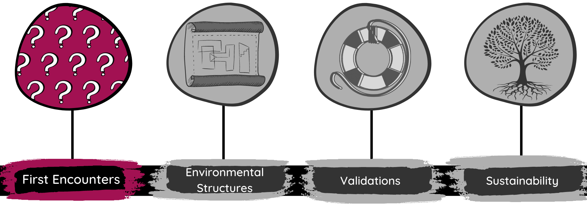</center>

???
So I think the best thing for me to do is go back to the beginning, during those first encounters I had with this pipeline's data within this position.
<br><br>
Now I know, I'm going to sound like I'm out of my mind again, but guys, the very first thing I learned during my first encounters in this journey was that...

---
class: light, animated, fadeIn

<h1><span>First Encounters</span></h1>

<center><br><br><br>
<p><i><font size = "48px">"The first step to building a data pipeline in R, <font color = "#A21152">is to <b>NOT</b> open R.</font>"</font></i></p>
</center>

???
sounds counter-intuitive...<br>
Let me give you some context..
---
class: light, animated, fadeIn
<h1><span>First Encounters</span></h1>


<p style="float: right;"><h2><b>Some Facts:</b></h2>
 <ul><li>Unfamiliar subject matter - opioid data</li><br>
     <li>A lot of data existed everywhere</li><br>
     <li>Organization did not have any pipelines</li><br>
     <li>Organization's expectations weren't clear</li><br>
    <li>No direction was given...</li></ul></p>
     
???
Some facts about how it was starting in this position...
- Not familiar with things<br>
- Data was everywhere<br>
- Organization didn't have pipelines, or expectations<br>
- thus -> No direction given...what's a newbie like myself to do?

---
class: light, animated, fadeIn
<h1><span>First Encounters</span></h1>

<h2><b>So What Did I Do?</b></h2>

<center>

</center>
     
???
Anyone seen Shaun of the Dead?<br>
Just like Shaun here...I Jumped into RStudio head-first 

---
class: light, animated, fadeIn
<h1><span>First Encounters</span></h1>

<h3><b>What I did vs. <font color = "#A21152"><i>What I Should Have Done</i></font></b></h3>

<center><br><br><br>
<b>I tried to create R programs immediately.</b>
<br><br>
--
<b><i><font color = "#A21152">I should have started investigating instead.</font></i></b><br><br>

</center>

???
I argue this point with an real-life example of something that happened to me at work<br>

---
class: light, animated, fadeIn
<h1><span>First Encounters</span></h1>

<h2><b>The Narcan Story</b></h2>


<center><br><br>

--
<b><i><font color = "#A21152">0,1,2,3 are numbers...right?</font><font color = "#5c0e0b"> <br>🚨"4+" is not...🚨</font></i></b><br><br>

</center>

???
Narcan is a medication that reverses opioid overdoses.
<br>
Got a data set with a variable called "Narcan" in it <br>
Opened RStudio IDE, visually looked at the variable <br>
Saw Numbers, so just like the Shaun a couple of slides ago <br>
... I jumped in head first <br>
...and proceeded to create reports and dashboards..
two months later, I had a random Eureka moment and decided to check the Narcan Variable...<br>
I found a value of "4+"...which is not a number<br>
Imagine the embarrassment of going back and telling everyone that everything I did was wrong


---
class: light, animated, fadeIn
<h1><span>First Encounters</span></h1>


<p style="float: right;"><h3><b>What I learned about First Encounters:</b></h3>

 <ul><li>Don't do any "real" coding...yet</li><br>
     <li>Ask for code books</li><br>
     <li>Understand the data's environment</li><br>
     <li>Understand the organization's environment</li><br>
     <li>Try to start creating "metadata"</li></ul>

     
???
So I learned alot clearly as seen here, but the main thing is to NOT jump into RStudio as soon as you get a dataset.<br>

If you do jump to coding, do the bare minimum to give you clues/info you need to start asking questions about the data and policies/processes in the organization <br> You can also document this early process by making a rough version of metadata. Where you track where data is coming from, what's in the data, who handles the data, etc.

<br>
A hard lesson I learned was that taking the time to take a step back and go through an iterative process of asking questions can give a bit more clarity and focus as you begin to start creating a data pipeline. <br>This is more important than just rushing to open RStudio because if you jump in with no information, head first, that pipeline can look like that first image I showed, but if we add clarity by taking the time to investigate...

---
class: dark, center, middle, animated, fadeIn


???
we'll find that things are still messy, but it can be just enough to help you refine and building processes.<b>
Once you accept the fact that you need to repeatedly do this process it's safe to start building out the foundation of the pipeline...


---
class: light, animated, fadeIn

<h1><span>Main Points</span></h1>
<br><br>
<center>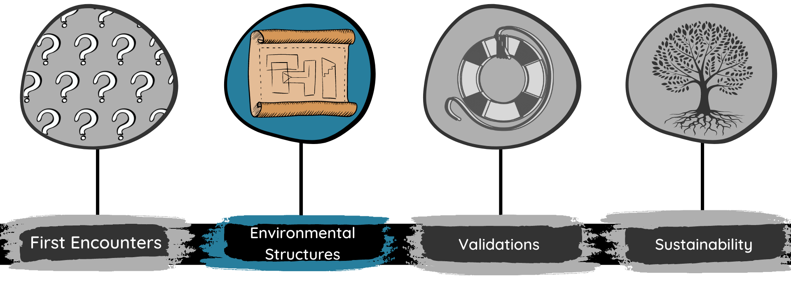</center>

???
by introducing actual environmental structure to the process now.

---
class: light, animated, fadeIn

<h1><span>Environmental Structures</span></h1>

<center><br><br><br>
<p><i><font size = "48px">"Data pipelines can exist in two environments that co-exist together; <font color = "#0B82B9"> <b>external</b> and <b>internal</b> environments.</font>"</font></i></p>
</center>

???
probably more sophisticated theories and ways to break this concept down even further, but being that it was my first time building a pipeline, it was more digestible for me to think about this concept as simply stating that a data pipeline has two environments that coexist and build off of each other.

---
class: light, animated, fadeIn

<h1><span>Environmental Structures</span></h1>

<center></center>

???
So when starting out, I realized I had external things to worry about outside of my computer<br><br>and internal things to worry about inside of my computer. To further explain both of these...

---
class: light, animated, fadeIn

<h1><span>Environmental Structures</span></h1>


<p style="float: right;"><h2><b>External Environment</b></h2>

 <ul><li>Data interactions, decisions, and processes that exist <b>externally</b> to your system.</li><br>
     <li>Administrative policies that affect the flow of data</li><br>
     <li>Technology that is used for data collection outside of R</li><br>
     <li>Data literacy of stakeholders and co-workers</li></ul></p><br>
     
???
In my xp, it was easier to ID the external environment first as this overlapped with the investigation process mentioned earlier. More data sources you have, more involved the process is. Knowing all I could about the external environment, helped guide what the structure would look like internally.

---
class: light, animated, fadeIn

<h1><span>Environmental Structures</span></h1>

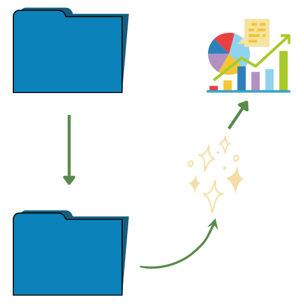

<p style="float: right;"><h2><b>Internal Environment</b></h2>

 <ul><li>Actual file structure and data flow <b>internally</b> on your system</li><br>
     <li>Flow of logic for data processing, analysis, and deliverable creation/deployment</li><br>
     <li>Method of data security and storage processes</li></ul></p>
     
???
ID internal environment is also essential. understanding the best way to set up your logic in things, nuances of any packages that you are, understanding what packages are essential for minimum functionality, Understanding the output needed for deliverables.<br><br>
Now, it should go without saying that this is not the reality...

---
class: light, animated, fadeIn

<h1><span>Environmental Structures</span></h1>

<center>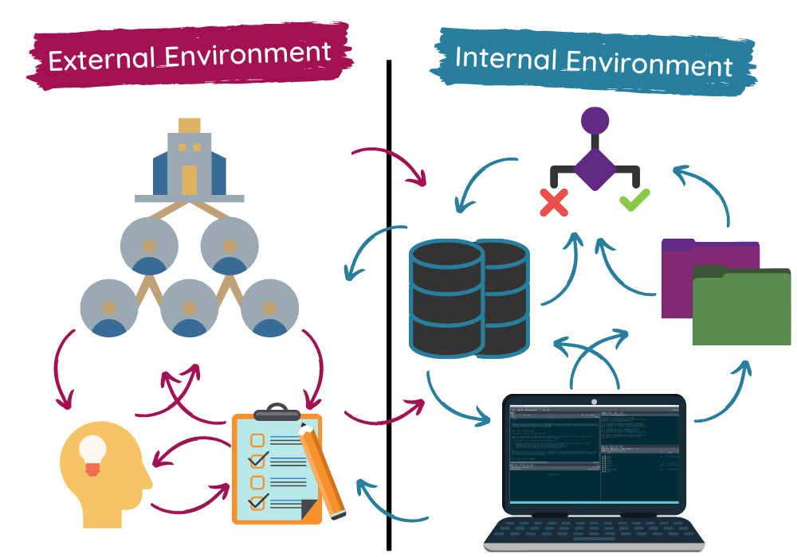</center>

???
These environments don't exist in silos. Clearly external things can affect internal things and vice versa...<br>
This is a challenge that every data person knows well. Even if you don't think about the data's environment in this way, those of you that work in non-profit, academia, or government can probably relate to feeling like some thing in your work is affected by bureaucracy or conflicting interests/decision..<br><br>
What helped me to better navigate the interactions between the two environments was to repeatedly tackle each environment by introducing structure, documentation, and workflow processes and adjusting for the other environment as needed. You can try your best to account for all of this things at the beginning, but it's hard to know "what" will influence "what" every time.

---
class: light, animated, fadeIn

<h1><span>Environmental Structures</span></h1>

<h5><b>Examples of Structuring the External Environment</b></h5>
<center><b>Making Metadata</b>
<br>
</center>

---
class: light, animated, fadeIn

<h1><span>Environmental Structures</span></h1>

<h5><b>Examples of Structuring the External Environment</b></h5>
<center><b>"Assess, Attempt, Repeat"</b>
<br>
</center>

---
class: light, animated, fadeIn

<h1><span>Environmental Structures</span></h1>

<h5><b>Examples of Structuring the Internal Environment</b></h5>
<center><b>Make Clean File Structures</b><br>
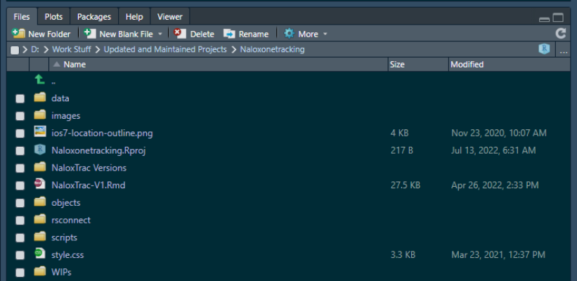</center>

???
It's always helped me to break files up by type (data/script)<br>
all data has a home, all scripts, and images, etc. has a home.<br>
Can look different for you based on your org situation.
---
class: light, animated, fadeIn

<h1><span>Environmental Structures</span></h1>

<h5><b>Examples of Structuring the Internal Environment</b></h5>
<center><b>Modularize Your Code</b><br>
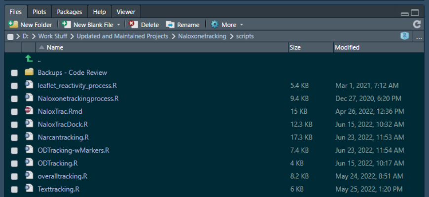</center>

???
You can modularize it by component<br>
Naloxtrac - Tracking dashboard that shows aggregate ODs and public Narcan locations<br>
---
class: light, animated, fadeIn

<h1><span>Environmental Structures</span></h1>

<h5><b>Examples of Structuring the Internal Environment</b></h5>
<center><b>Modularize Your Code</b><br>
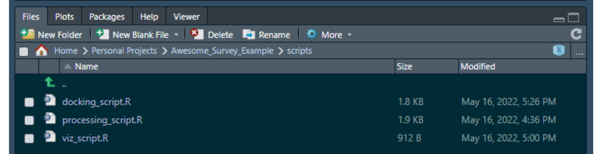</center>

???
Can modularize it by function - especially if you're only working with fewer data sources
---
class: light, animated, fadeIn

<h1><span>Environmental Structures</span></h1>

<h5><b>Examples of Structuring the Internal Environment</b></h5>
<center><b>Connect and Chain Where It Makes Sense</b></center>

```{r, eval = FALSE}
#==============================#
# Library Load-in====
#==============================#
library(tidyverse) # For everything data
library(googlesheets4) # For interacting with Google Drive
library(janitor) # To keep things clean
#==============================#
```

---
class: light, animated, fadeIn

<h1><span>Environmental Structures</span></h1>

<h5><b>Examples of Structuring the Internal Environment</b></h5>

```{r, eval = FALSE}
#==============================#
# Data Process Checks====
#==============================#
data_updated <- FALSE

#Data Load in#
Mainspreadsheet <- "Google Link to Spreadsheet HERE"
invisible(readline(prompt=c(gs4_auth(), "Press ENTER to confirm selection")))

#Spreadsheet being pulled into the environment#
new_data <- read_sheet(Mainspreadsheet, sheet = "Version 1" ) %>%
  select(c(2:4,6,7))

#Pulling in "Master" file to scan for any changes#
master_data <- readRDS("data/master_data.rds")

#Data "Validation"#
data_updated <- nrow(new_data) != nrow(master_data) 
```

---
class: light, animated, fadeIn

<h1><span>Environmental Structures</span></h1>

<h5><b>Examples of Structuring the Internal Environment</b></h5>
```{r, eval = FALSE}
#==============================#
#Logic Flow for Processing====
#==============================#
# If data has changed, a separate processing program is launched.#
# And a new master file is saved once it completes.#
if(data_updated){
  source("scripts/processing_script.R")
}

# Pipeline returns to the dock and launches a new script to make visuals 
# Only if the data was updated#

#Visual Creation#
if(data_updated){
  source("scripts/viz_script.R")
}
```

---
class: light, animated, fadeIn

<h1><span>Environmental Structures</span></h1>

<h5><b>Examples of Structuring the Internal Environment</b></h5>
```{r, eval = FALSE}
#==============================#
#Rendering of Deliverable====
#==============================#
# Pipeline returns to the dock and renders the associated Markdown report
rmarkdown::render("reports/example_report.Rmd",
                  output_file = "example_report.html")
```

---
class: dark, center, middle, animated, fadeIn


???
Added environmental structure

---
class: light, animated, fadeIn

<h1><span>Main Points</span></h1>
<br><br>
<center>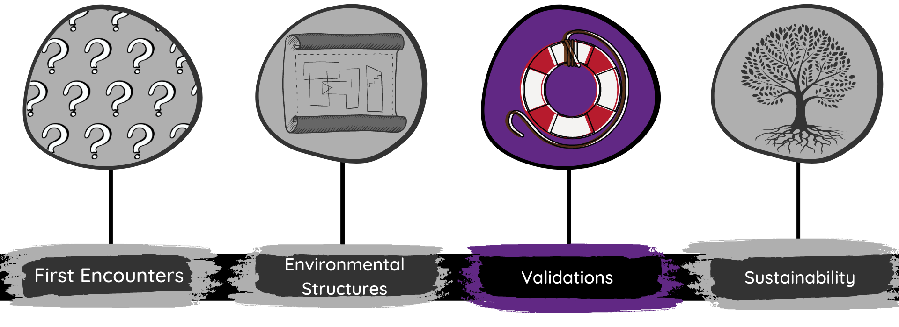</center>

---
class: light, animated, fadeIn

<h1><span>Validations</span></h1>

<center><br><br><br>
<p><i><font size = "48px"><font color = "#612884"><b>"Check</b> yourself</font>, before you wreck yourself"</i><br>😭</font></p>
</center>

???
Guys, I feel like I'm exposing myself here, but the biggest thing I learned about validations were to do them<br>
I still have a lot to learn myself about performing data validations efficiently.

---
class: light, animated, fadeIn
<h1><span>Validations</span></h1>

<h2><b>The Narcan Story</b></h2>

<center><br>
<font color = "#FF1616"><b>Pain<b></font> could have been avoided if I <b>validated</b> that "Narcan" variable.<br>

Assumed all the values were `numeric` types when they were really `character` types<br><br>

This situation needed a <b>variable "Type" check</b></center>

---
class: light, animated, fadeIn
<h1><span>Validations</span></h1>

There's lot of validation types to consider. What you'll need for your circumstances depends on:
-   Data Types

-   External Validations

-   Method of Collection

-   Other things that you'd probably never think of🙃

---
class: light, animated, fadeIn
<h1><span>Validations</span></h1>

<h5><b>Examples of Validations Types I've personally used:</b></h5>
<br><center>
</center>

---
class: light, animated, fadeIn
<h1><span>Validations</span></h1>

Validations can <b><font color = "#612884">exist in external and internal environments</font></b><br>

<b>Best scenario</b>: Validations are implemented <b><font color = "#612884">externally</font></b><br>
<center>
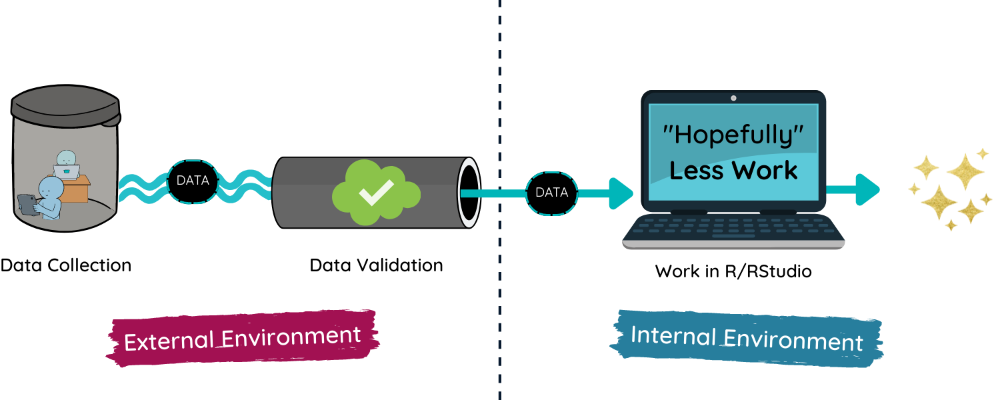</center>

---
class: light, animated, fadeIn
<h1><span>Validations</span></h1>

Validations can <b><font color = "#612884">exist in external and internal environments</font></b><br>

<b>Usual scenario</b>: Programmer has to implement it <b><font color = "#612884">internally</font></b>

<center>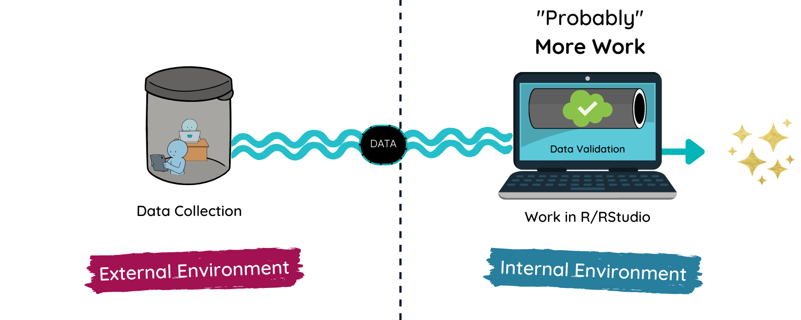</center>

---
class: light, animated, fadeIn
<h1><span>Validations</span></h1>
I did all of my validations manually in R...but there's a package for that!
<br><br>
[The `validate` Package]("https://github.com/data-cleaning/validate")<br>

<p style ="font-size:20px">MPJ van der Loo and E de Jonge (2020). Data Validation Infrastructure for R. <i>Journal of Statistical Software</i>, Accepted for publication. <a href="https://arxiv.org/abs/1912.09759">https://arxiv.org/abs/1912.09759</a></p>

<br>

[The Data Validation Cookbook]("https://cran.r-project.org/web/packages/validate/vignettes/cookbook.html#Preface)</p>

<p style ="font-size:20px">MPJ van der Loo (2022) <i>The Data Validation Cookbook version 1.1.1. <a href="https://data-cleaning.github.io/validate">https://data-cleaning.github.io/validate</a></p>

???
Nothing wrong with doing it manually<br>
Can be cumbersome (depending on the problem)<br>

---
class: dark, center, middle, animated, fadeIn


???
adding validation
---
class: light, animated, fadeIn

<h1><span>Main Points</span></h1>
<br><br>
<center>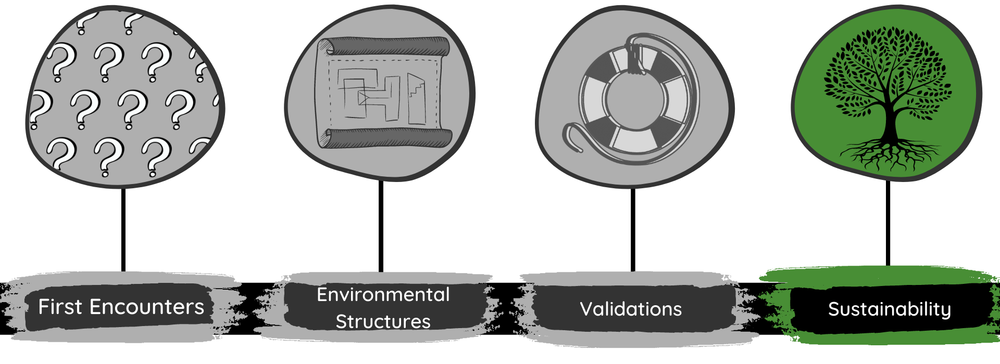</center>

---
class: light, animated, fadeIn

<h1><span>Sustainability</span></h1>

<center><br><br><br>
<p><i><font size = "48px">"Sustainability" can mean and look like <font color = "#488E35"><b>a lot of different things</i></font></p>
</center>

???
Def: Capability of something that can be maintained at length without interruption or weakening.

---
class: light, animated, fadeIn

<h1><span>Sustainability</span></h1>

What sustainability looks like in your organization will depend on:
<br>
<center>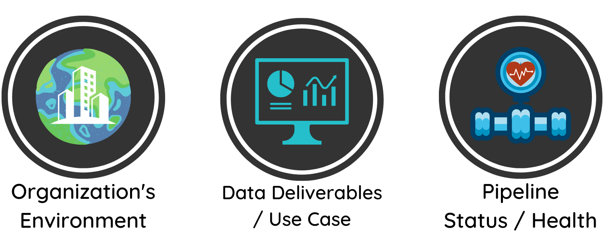</center>

???
I didn't get to do much work for sustainability because of my the organization's environment<br>
I was the data team/programmer/analyst/data viz designer<br>
There was no time for comprehensive sustainability work - This is not uncommon.
<br>
Although it can look different, in my xp, there's a few main examples I can think of that I would have liked to implement in my last position.

---
class: light, animated, fadeIn

<h1><span>Sustainability</span></h1>

<h5><b>Examples of Sustainability Efforts:</b></h5>
-   Data Centralization
-   <font color = "#488E35">Data Workflow Documentation</font> 🌟
-   <font color = "#488E35">Codebooks</font> 🌟
-   <font color = "#488E35">Automated Docking Scripts </font>🌟
-   Adopted Data Standardization/Validations
-   Scheduled Code Reviews
-   Pipeline QA and QI
-   <font color = "#488E35">Operational Documentation🌟</font>
-   Making Scalable Code

???
Patience is needed here: Although talking about the sustain. of the pipeline<br>
So much sustainability work involves the external environment<br>
Sustainability is hard..a lot of times, data teams may not have the bandwidth to take this on<br>
Centralization - Data is stored into one place (warehouse) but is accessible from multiple projects/scripts<br>
<br>
Planning for sustainability 
---
class: light, animated, fadeIn

<h1><span>Sustainability</span></h1>

<center>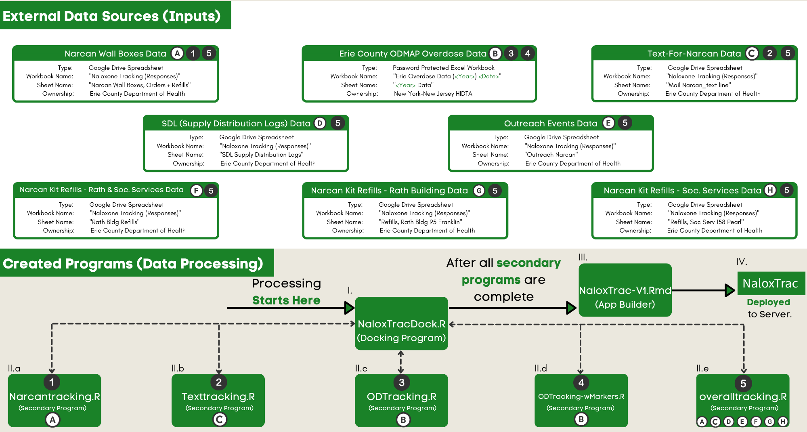</center>

---
class: light, animated, fadeIn

<h1><span>Sustainability</span></h1>

<center>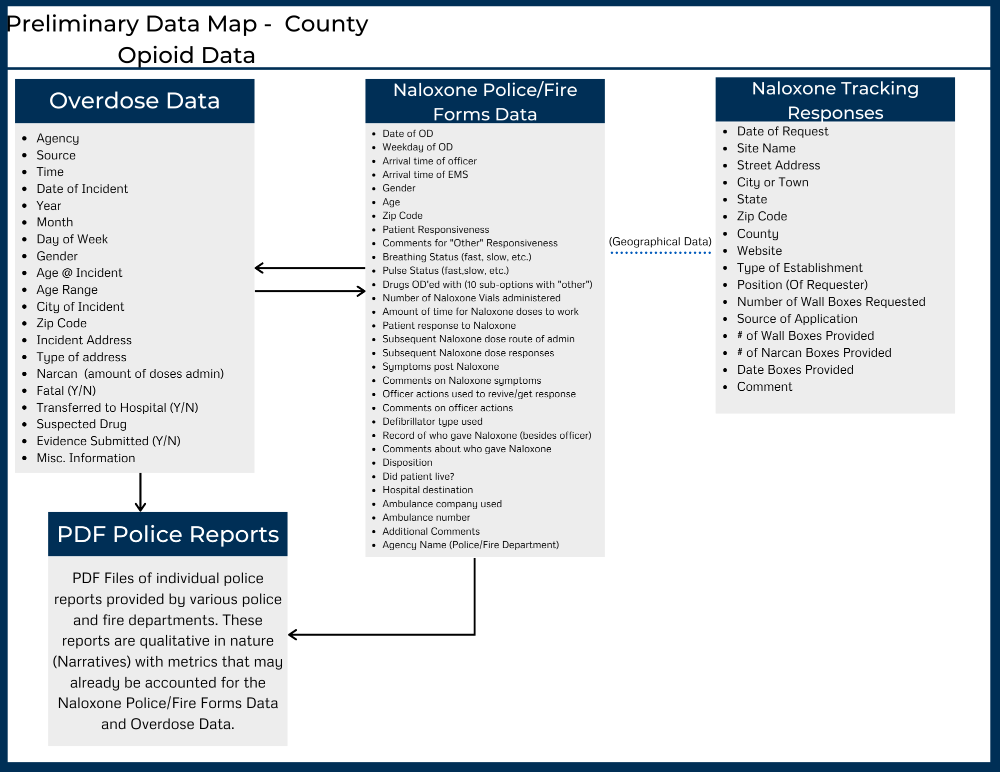</center>

---
class: light, animated, fadeIn

<h1><span>Sustainability</span></h1>

<center>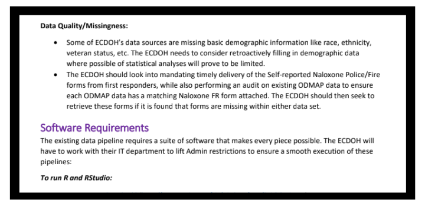</center>

---
class: dark, center, middle, animated, fadeIn


???
head first

---
class: dark, center, middle, animated, fadeIn


???
starting investigations

---
class: dark, center, middle, animated, fadeIn


???
adding structures 

---
class: dark, center, middle, animated, fadeIn


???
adding validations

---
class: dark, center, middle, animated, fadeIn


???
creating and maintaining sustainability
The main point that, even after putting so much work into it, I still think it looks mysterious